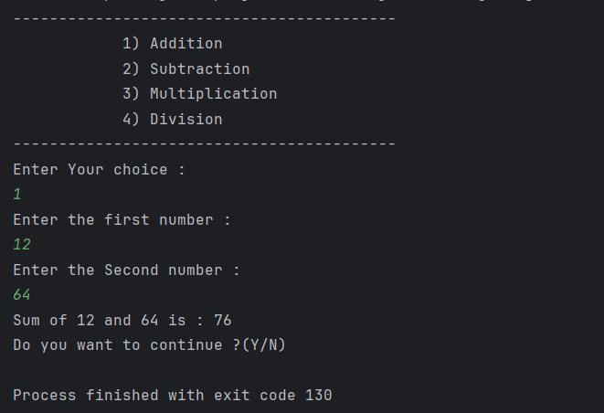
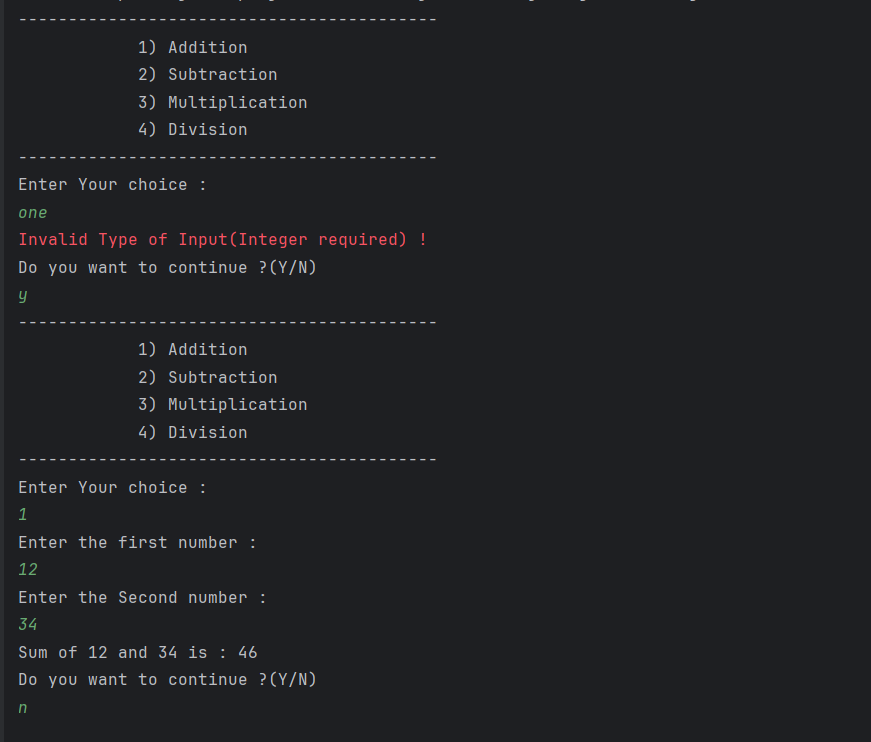
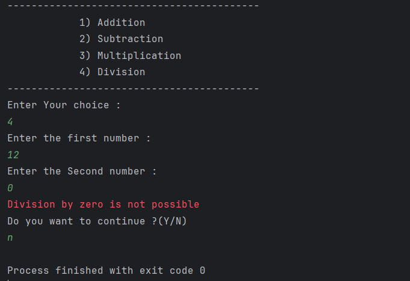

# 🧮 CLI Calculator in Java

A simple yet powerful **Command-Line Calculator** written in Java. Built as part of my Java Developer role at **Elevate Lab**, this calculator performs basic arithmetic operations in a clean, menu-driven interface. 🚀

---

## ✨ Features

- ✅ Addition, Subtraction, Multiplication, Division
- 📟 Menu-driven CLI interface
- 💡 User input validation for a smooth experience
- 🧼 Object-Oriented Design (OOP)
- 🔁 Continuous operation until the user exits

---

## 📸 Demo

Here’s how the calculator works in the terminal:


*Menu-driven options with clean layout*


*Sample addition operation*


*Graceful handling of division by zero*

---

## 📁 Project Structure

calculator/
├── CalculatorApplication_CLI.java
├── images/
│ ├── screenshot1.png
│ ├── screenshot2.png
│ └── screenshot3.png
└── README.md

---

## 🚀 How to Run

### 1. Compile the files
```bash
javac CalculatorApplication_CLI.java

java CalculatorApplication_CLI

🛠 Tech Stack
Java SE

CLI (Command Line Interface)

Git & GitHub

🔮 Future Upgrades (Planned)
 Scientific calculator mode (square root, exponent, log)

 Save session history to file

 GUI version using JavaFX or Swing

 Unit testing with JUnit

🙋‍♂️ Author
Made with ❤️ by HARI PRASATH K
🚀 Part of the Elevate Lab - Java Developer Role

⭐️ Show Your Support
If you found this helpful or inspiring, please consider:

⭐️ Starring this repository

🍴 Forking it

🔁 Sharing it

Thanks for visiting!
